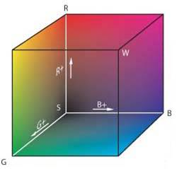
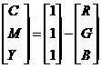
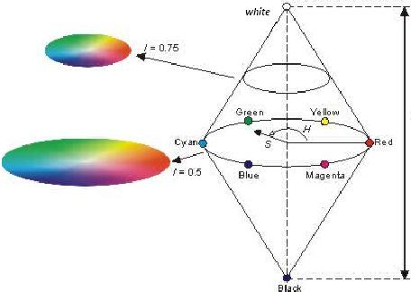
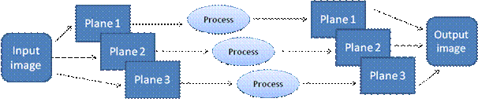

A color image is represented and stored as a set of three matrices each of size MXN. Each matrix represents a colour plane. Thus if an RGB model is used, we have a red image, blue image and a green image and thus 3 corresponding matrices. Other colour models are also popular in practice.

The RGB and CMY colour models can be visualized as forming a colour cube shown below. Here, red, green and blue form the three orthogonal edges of the cube while cyan, magenta and yellow form the opposite set of edges of the same cube. Note that the corner (S) where the RGB edges meet corresponds to black colour while the corner (W) where the CMY edges meet corresponds to the white colour. Any point within this cube can therefore be specified in terms of 3 coordinates, namely RGB or CMY values. The diagonal line that connects the black and white points will correspond to the grayscale.

Fig 1. RGB colour space

Relationship between the RGB and CMY colour model is hence as follows.

Other colour models separate the colour (chromatic) and intensity (achromatic) information. The HSI and YCbCr are two such models you will study.

HSI colour model: Here the chromatic information is represented in two components: hue (H) and
saturation (S), while the achromatic information is represented by the third intensity component (I). The Hue component represents what we commonly understand to be colour. It is represented as a point on a circle and hence is specified as an angle between [0,360] degrees. 0 degree mean red, 120 means green 240 means blue. 60 degrees is yellow, 300 degrees is magenta.

The saturation component signals the spectral purity of the color, i.e. how much it is diluted with white color. For example it helps differentiate between sky blue and navy blue. The value of the saturation component is specified as a number in the interval [0,1].

The HSI model is visualized as a colour spindle (or a double cone) shown below with white and black forming the two ends of the spindle. As one moves up and down the spindle, only I value changes so the pixel appears bright or dull but there is no change in the chromatic content. By contrast, as one moves along the surface of the cone at a fixed radius, the chromatic content changes.

Fig 2. HSI colour space

YCbCr colour model : This model represents the chromatic content with two components :

1. Cb - the chrominance of the blue difference
2. Cr - the chrominance of the red difference

Finally, the achromatic component is specified by the Y or the luminosity (roughly the brightness) component. The YCbCr color space is widely used for digital videos.

Processing in the colour domain :

There are two ways for processing in colour domain

(a)    Scalar processing: Process each plane of colour model individually. In this processing, one can process only one or two planes and leave remaining planes unchanged. For example if we want to modify the red component present in colour image, then modify only red plane in RGB colour model and leave other planes unchanged. After processing the image is converted to RGB space for display.

(b)   Vector processing : Consider each pixel of the image as a three element vector, each element corresponding to information from each of the color planes. Instead of processing the image in each plane separately , as we did in the previous case. all planes of colour model are processed simultaneously.

 